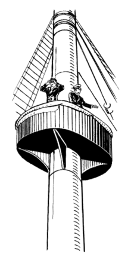

# Foremast

## Foremast

### What It Does

Foremast is a service health detection and canary analysis system for Kubernetes.

Foremast is an early warning system for detecting problems with the deployment of a new version of a service or component. Production deployments have used manual canary analysis for a few years now in various forms, be it A/B testing, phased rollout, or incremental rollout.

Foremast enables automated canary analysis that scores the health of new deployments on the basis of performance, functionality, and quality. In the case of rolling updates, the analysis should also be performed for the cluster as a whole to confirm the success of the upgrade for the whole application.

It addresses following problems in an enterprise environment of Kubernetes:

* Detect metrics spike or drop due to a deployment
* Detect impact to downstream services
* Automated remediation including alert, rollback etc
* Metrics anomaly Aggregated at service or API level
* Aggregate service health check across multiple K8s clusters

Check out the [architecture and design](docs/design.md).

## Deploying to a Cluster

### Technical Requirements

Make sure you have the following prerequisites:

* A local Go 1.7+ development environment.
* Admin access to a Kubernetes cluster.

### Setup Steps

How to [Set Up](docs/installation.md).

## Roadmap

#### v0.5

*  Controller/CRD with time series modeling
*  More machine learning models for different time series data behavior

## Contributing

We encourage you to get involved with Foremast, as users or contributors and help with code reviews.

Read the [contributing guidelines](docs/contributing.md) to learn about building the project, the project structure, and the purpose of each package.

