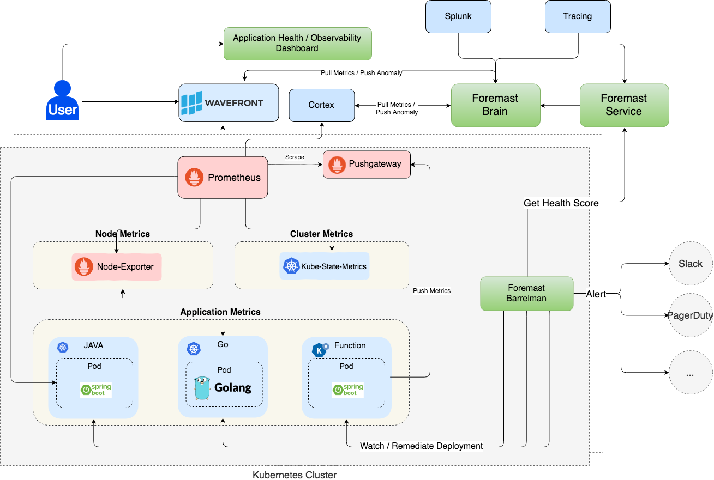

# Foremast

## Foremast

Foremast is a cloud native application health manager for Kubernetes. Foremast leverages observability signals from platforms such as Prometheus, Fluentd and Jaeger and provides timely application health alerts. These alerts are especially important during deployments and other changes that alter application state. This information is then leveraged by Foremast’s action framework - which allows developers and operators to take actions based on the state of the application.

**_How can developers reliably know that changes made to running software have not degraded the application?_**

Foremast provides early warnings for detecting problems with the deployment of a new version of a service or application on Kubernetes. 

Traditionally, production deployments have used manual canary analysis as the standard mechanism for evaluating application health. Various types of canary analysis exist, such as: A/B testing, phased rollout, or incremental rollout.

Foremast automates the analysis of an application health, by scoring the health of new deployments on the basis of performance, functionality, and quality. This analysis provides a comprehensive picture of an application's health and enables corrective action if a deterioration in health is detected.

It addresses following problems in an enterprise environment of Kubernetes:

* Detect metrics spike or drop due to a deployment
* Detect impact to downstream services
* Automated remediation including alert, rollback etc
* Metrics anomaly aggregated at service or API level
* Aggregate service health check across multiple K8s clusters

The [architecture and design](docs/guides/design.md) documentation provide a detailed overview of the system and an under the hood view of how Foremast works.

## Running Foremast

Foremast can be run in multiple modes
- On Minikube
- On a remote K8s cluster

### Technical Requirements

Make sure you have the following prerequisites:

* A local Go 1.7+ development environment
* Admin access to a Kubernetes cluster - this could either be Minikube or a remote cluster.

### Setup Steps

The [Set Up](docs/guides/installation.md) documentation has step by step instructions on how to setup and run Foremast.

## Roadmap

- January 2019 [v0.5](https://github.com/intuit/foremast/issues?q=is%3Aopen+is%3Aissue+milestone%3A0.5)
- February 2019 [v0.6](https://github.com/intuit/foremast/issues?q=is%3Aopen+is%3Aissue+milestone%3A0.6)
- March 2019 [v0.7](https://github.com/intuit/foremast/issues?q=is%3Aopen+is%3Aissue+milestone%3A0.7)

## Contributing

We welcome you to get involved with Foremast. You can contribute either by using Foremast and providing feedback, or contribute to our code, participate in our code and design reviews etc.

Read the [contributing guidelines](docs/guides/contributing.md) to learn about building the project, the project structure, and the purpose of each package.
