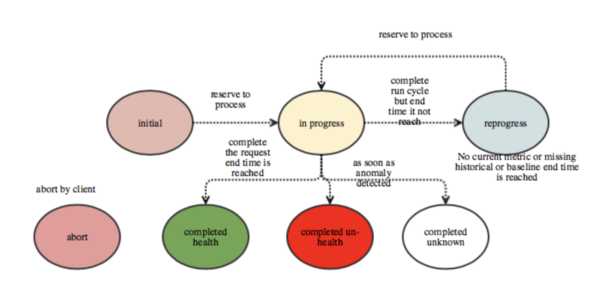

# Design

## Architecture

### Foremast Barrelman

Barrelman is a component to watch the Deployment change in DeploymentTime and start to monitor the deployment metrics or related information, make sure the deployment will be healthy. If it detects unhealthy status, it can trigger remediation actions.  The monitoring can be triggered by kubectl or foremast UI in the future. So that Barrelman can watch the application status in runtime also.

### Foremast Service

Foremast service offers internal APIs that interacts with the underly Data Store, publish the request message to message bus, retrieve the request status  to Service Client. 

Foremast Service can request from different clusters. 

There are two main Restful API. One is create request. Foremast Service will validate the request , store to data store, publish the request to message bus \(future release\) and then return id response.

The the second one is  search by id. Client can base on id to retrieve the status of request . Once Foremost Brain completed the application health judgement, it will return health, un-health or unknown\(if current metric is not there\) with reason.

In the future release Foremast can support re-occurring monitoring request.

Foremast service will  monitor , schedule  the tasks based on request status and configuration.

### Foremast Brain

Foremast Brain is the consumer of the Foremast service request. It is brain of Foremast.

Based on the configuration it will first query the historical metric from metric store, compute the machine learning/statistic algorithm model,  for canary deployment  it will query the baseline and current metric and perform pairwise algorithm to check if both have same distribution pattern,  if current and baseline has different distribution pattern, it will be lower threshold. and then use threshold to detect current anomaly data points based on  historical mode .

**Horizontal Scaling**  Foremast Brain can be horizontal scaling via adding more nodes.  

**Fault Tolerant**  If there is any request is processed more than X minute \(configurable\), other Foremast Brain can take over and reprocess the request.

**Shared-Nothing Architecture** each Foremast Brain node is independent, and there is no single point of contention across the system. 

**Fail Fast**: If any anomaly is detected , Foremast Brain will mark the statue as completed un-health before endTime is reached. Otherwise, Foremast Brain will continuous to monitor and check if there is any anomaly until endTime is reached.

### Monitoring/Alerting

We leverage ElasticSearch as datastore to store the request content and status. Foremast Brain not only update the request status but also provide reason and anomaly information if there is any failure or anomaly gets detected.

You can locate the request status and detail via Kibana dashboard.

### Models  

<table>
  <thead>
    <tr>
      <th style="text-align:left">One Metrics</th>
      <th style="text-align:left">Two Metrics</th>
      <th style="text-align:left">3+ More</th>
    </tr>
  </thead>
  <tbody>
    <tr>
      <td style="text-align:left">
        
​

        <ul>
          <li>Moving Average</li>
          <li>Exponential Smoothing</li>
          <li>Double Exponential Smoothing</li>
          <li>Holt-Winters</li>
          <li>Prophet (facebook)</li>
        </ul>
      </td>
      <td style="text-align:left">
        
​

        <ul>
          <li>Bivariate Normal Distribution</li>
        </ul>
      </td>
      <td style="text-align:left">
        
​

        <ul>
          <li>Deep Learning (LSTM)</li>
        </ul>
      </td>
    </tr>
  </tbody>
</table>We also support pairwise algorithm \(baseline vs current\)

* Mann-Whitney, Wilcoxon, Kruskal
* Fried manchi square \(special case\)

