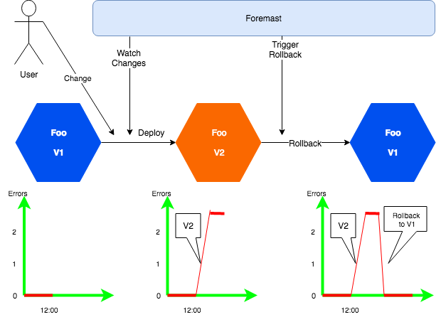
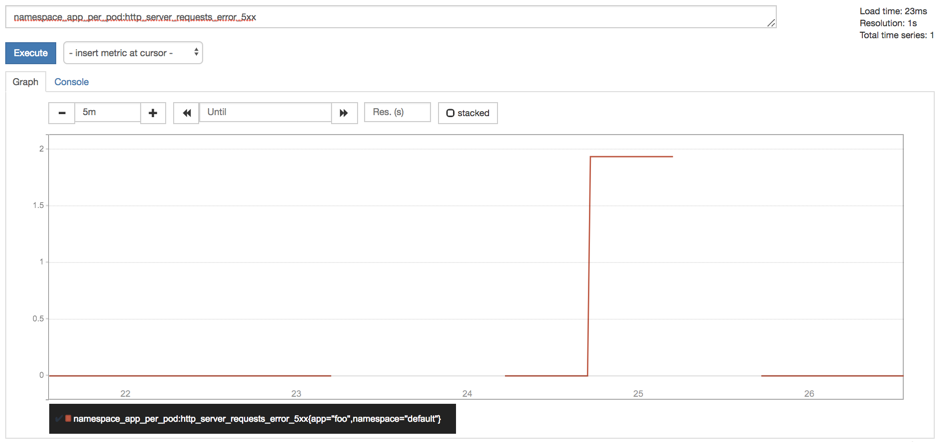

# Installation


## Installation

With an introduction to the core concepts in the previous section, lets move onto setting up foremast and using it.

### Install All-in-One

#### Minikube

**Make sure your compute has at least 4096MB memory.**

If you don't have kubenertes cluster, you can have you own minikube setup in your local environment. Please check out minikube settings [https://kubernetes.io/docs/setup/minikube/](https://kubernetes.io/docs/setup/minikube/).  
  
Once you got minikube installed in your local, please use our suggested minikube startup shell, `deploy/minikube.sh` . The shell gives enough memory to make sure all pods will be started correctly.

#### Prometheus

```text
$ kubectl create -Rf deploy/prometheus-operator/
$ kubectl get pods -n monitoring

NAME                                  READY   STATUS    RESTARTS   AGE
alertmanager-main-0                   2/2     Running   0          6h
alertmanager-main-1                   2/2     Running   0          6h
alertmanager-main-2                   2/2     Running   0          6h
grafana-5b68464b84-vvth6              1/1     Running   0          6h
kube-state-metrics-58dcbb8579-7dt95   4/4     Running   0          6h
node-exporter-zt8qh                   2/2     Running   0          6h
prometheus-k8s-0                      3/3     Running   1          6h
prometheus-k8s-1                      3/3     Running   1          6h
prometheus-operator-587d64f4c-lvzsn   1/1     Running   0          6h
```

#### Hints: if you get error when you running the creation, please run the command again.

#### Foremast

```text
$ kubectl create -Rf deploy/foremast/

$ kubectl get pods -n foremast

NAME                               READY   STATUS    RESTARTS   AGE
barrelman-85c67bbbb5-nh5sl         1/1     Running   0          1h
elasticsearch-0                    1/1     Running   0          5h
foremast-ai-api-867fc9f756-pt6lz   1/1     Running   0          5h
foremast-engine-748d45cc98-qph54   1/1     Running   0          5h
```

### Install Foremast with existing Prometheus

#### Prometheus settings

Change yaml file `deploy/foremast/barrelman/deployment-metadata-default.yaml`, put the correct prometheus endpoint

```text
spec:
  metrics:
    dataSourceType: prometheus
    endpoint: http://prometheus-k8s.monitoring.svc.cluster.local:9090/api/v1/
```

#### Foremast

```text
$ kubectl create -Rf deploy/foremast/

$ kubectl get pods -n foremast

NAME                               READY   STATUS    RESTARTS   AGE
barrelman-85c67bbbb5-nh5sl         1/1     Running   0          1h
elasticsearch-0                    1/1     Running   0          5h
foremast-ai-api-867fc9f756-pt6lz   1/1     Running   0          5h
foremast-engine-748d45cc98-qph54   1/1     Running   0          5h
```

## Run example



Foo is a spring boot application with a metric "http\_server\_requests\_errors", the metric shows the errors happen during the http requests.  **V1** is a normal application, the error count is always **ZERO. V2** is an error generator version, it can generate 5xx error based on the environment settings. This example is to simulate a typical deployment error, then foremast helps to roll it back.

#### Run foo v1

```text
$ kubectl create -Rf examples/foo/v1/
$ kubectl get pods

NAME                   READY   STATUS    RESTARTS   AGE
foo-6948547dcd-9dglf   1/1     Running   0          7m
```

#### Metrics in prometheus

If you are running in "All-In-One" mode, you can try the following command to export the prometheus UI.  

```text
$ ./deploy/export/prometheus.sh

Forwarding from 127.0.0.1:9090 -> 9090
Forwarding from [::1]:9090 -> 9090
Handling connection for 9090
```

You can type "[http://localhost:9090/graph](http://localhost:9090/graph)" in your browser after that.   
Search for`namespace_app_per_pod:http_server_requests_errors` and display the metric with tab **Graph**, you are going to see a error chart.

#### Run foo v2

Wait at least **5 minutes** to let it have historical data. Then roll out V2 to see what will happen.

```text
$ kubectl replace -f examples/foo/v2/foo_v2.yaml
```

Use following command to check the deployment status

```text
$ kubectl get deploymentmonitor foo -o yaml
```

It will show following information, if the deployment is considered as unhealthy, it will show "Unhealthy" and roll it back the v1.

```text
status:
  anomaly: {}
  expired: false
  jobId: 6fff8856b554115bc3c94ce9eb89fd86808f94458ed559c6c3fe67c91342e4b2
  phase: Unhealthy
```

Once you see the "Unhealthy" phase, foremast triggers a rollback, you can check the running version with following command, it should run the V1.

```text
$ kubectl get deployment foo -o yaml
```

Within the prometheus metric chart, you can also see the error count trend after couple minutes.




## Uninstallation

### Uninstall All-in-One

```text
$ kubectl delete -Rf examples/foo/v1
$ kubectl delete -Rf deploy/foremast/
$ kubectl delete -Rf deploy/prometheus-operator/
```

### Uninstall Foremast and example only

```text
$ kubectl delete -Rf examples/foo/v1
$ kubectl delete -Rf deploy/foremast/
```


