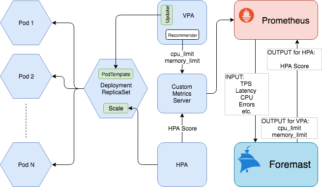
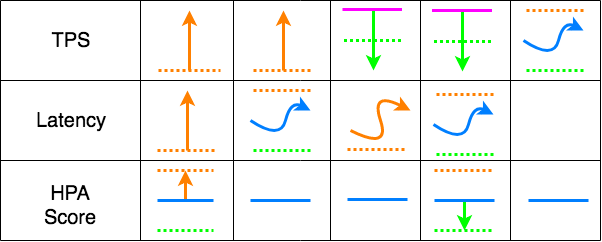
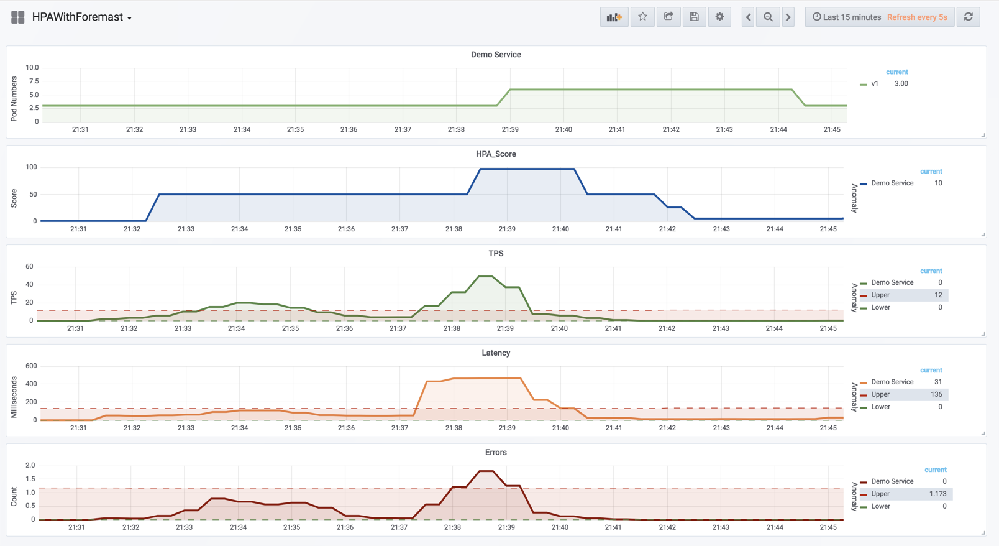

# HPA & VPA with Foremast

- HPA - The Horizontal Pod Autoscaler automatically scales the number of pods in a replication controller, deployment or replica set based on observed CPU utilization (or, with custom metrics support, on some other application-provided metrics)

- VPA - Vertical Pod Autoscaler (VPA) frees the users from necessity of setting up-to-date resource requests for the containers in their pods. When configured, it will set the requests automatically based on usage and thus allow proper scheduling onto nodes so that appropriate resource amount is available for each pod.

###Problem statement
####HPA
1. As an application developer it is very hard to
Determine whether the application is CPU bound, network bound or traffic bound.
1. Which metric should I set up for the HPA.
1. Give right thresholds for CPU and memory for VPA.


####VPA

1. Also VPA picking 50%,95% as lower bound and upper bound is not accurate.
1. All those information can be captured by historical data of the application itself.  So we can leverage automation instead of human decision to do that. 

That’s the good area where Foremast can help.

###Proposal


###HPA
Foremast calculates an unified “HPA score” in range [0-100] which can be set in HPA.
Foremast determines what good metrics should be mixed in this “HPA score” for the specific application, based on historical data.
Foremast calculates the score by those selected metrics.
The score reflects the pod number change requirement for HPA.


###VPA
Foremast calculates CPU and memory limits for each containers based on historical data of each containers periodically.
The CPU and memory limits can be feed into a New VPA Recommender.
This will make VPA accurate and simpler.

###HPA Score



*red dashed line indicates high bound, green dashed line indicates low bound, purple line indicates historical mean.


###Sample
####HPA

```yaml
apiVersion: autoscaling/v2beta1
kind: HorizontalPodAutoscaler
metadata:
 name: hpa-demo
 namespace: foremast-examples
spec:
 minReplicas: 3
 maxReplicas: 10
 metrics:
 - type: Object
   object:
     metricName: foremastbrain:namespace_app_per_pod:hpa_score
     target:
       apiVersion: apps/v1
       kind: Deployment
       name: hpa-demo
     targetValue: 50
 scaleTargetRef:
   apiVersion: apps/v1
   kind: Deployment
   name: hpa-demo
```

HPA_Score by TPS and  Latency

